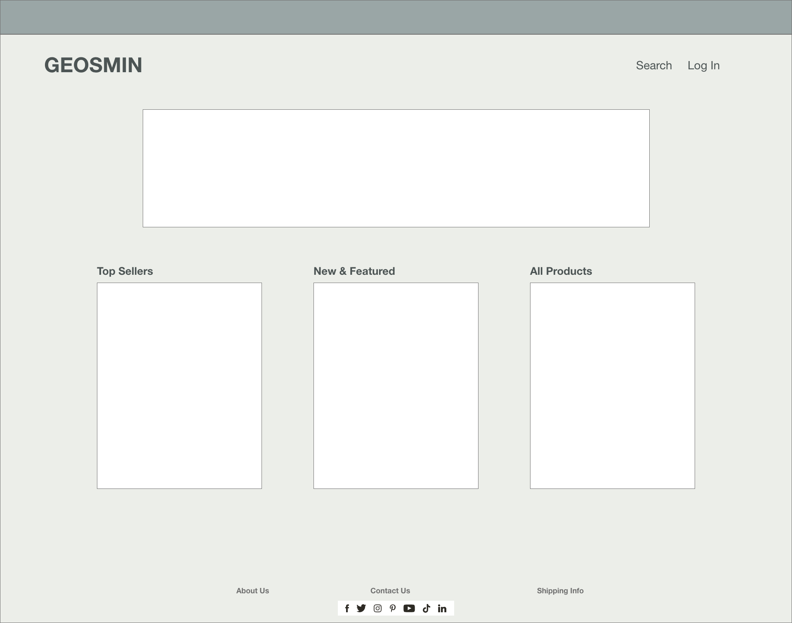
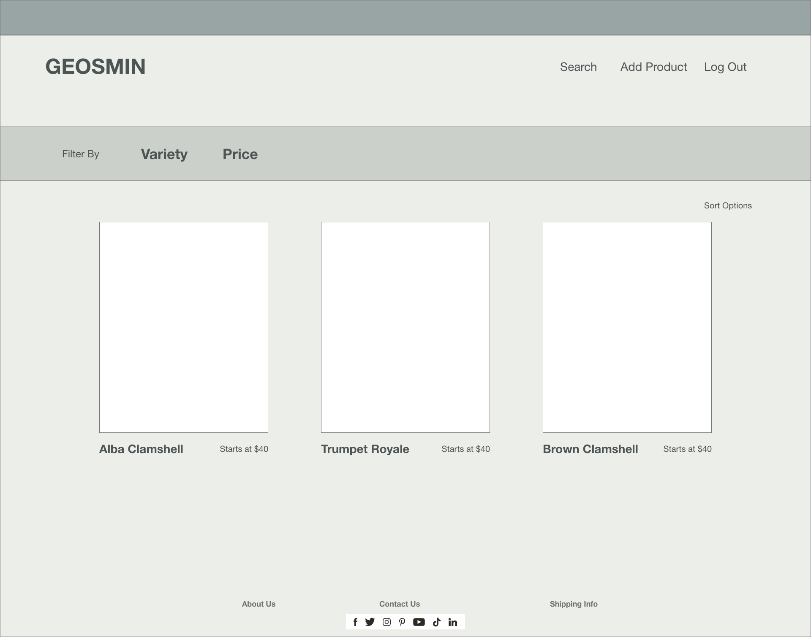
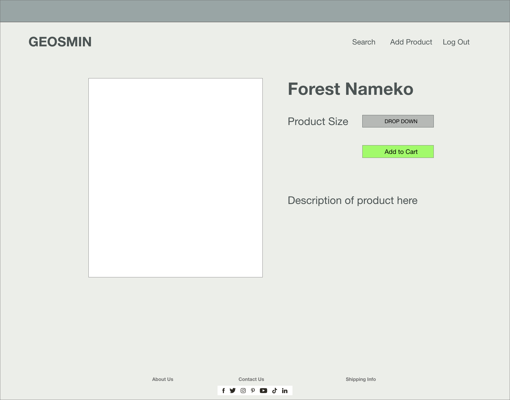

# GEOSMIN
## A gourmet mushroom and microgreen urban farm store

## Project Description
Geosmin is a vending React App collectively built by three team members. This online store exhibits authentication and full CRUD using Express, Mongoose, and MongoDB. In a git flow style we've adhered to strict React arhitecture organization.

## Component Hierarchy

## API and Data Sample

## MVP
### Client (Front End)
Have a working, interactive React app built using npx create-react-app client  
Have at least 6 separate, rendered components in an organized and understandable React file structure.  
Utilize functional and class React components appropriately.  
Use only React for DOM Manipulation.  
Consume data from your API, and render that data in your components.  
Utilize React Router, for client-side routing.  
Authentication!  
Landing Screen  
Listing Screen  
Detail Screen  

### Server (Back End)
Have working generic controller actions for full-CRUD using Express, Mongoose, and MongoDB.  
Authentication!  

### Styling
Be styled with CSS.  
Use flexbox (display: flex) or CSS Grid.  
Implement responsive design on 2 screen sizes (including desktop) using a media query (mobile).  

### Deployment
Deploy the fully functional front-end via Netlify.  
Deploy the back-end via Heroku.  
Deploy the MongoDB database on MongoDB Atlas.  

## Post-MVP 
Build a custom hook  
Parallax effect  
Customer reviews &&|| rating
Create a second user (besides admin) with limited privileges   

## Adobe XD Prototype

## Timeline
| Day               | Deliverable                                                  
| ------------------| -------------------------------------------------------------
| Monday Jan 4th    | (project approval / start code)
| Tuesday Jan 5th   | (back end done / front end skeleton)
| Wednesday Jan 6th | (CRUD done / Auth)
| Thursday Jan 7th  | (Auth done / style)
| Friday Jan 8th    | (MVP done)
| Monday Jan 11th   | (Post MVP)
| Tuesday Jan 12th  | (Touch ups / present)

# GROUP TEAM PLANNING
## Team
Hunter Mott, Michael Pakulak, Jeri Dilts (Git Czar)

### Team Goals & Values
Functional Code  
Interactive, Attractive UI  
Thorough Communication Between Teammates  

### Personal Strengths
Hunter - React UI/CSS  
Michael - React UI/CSS / Backend  
Jeri - React UI / Backend  

### Personal Challenges (Could Use More Exposure)
Hunter - Backend / Auth  
Michael - Auth / React hooks  
Jeri - CSS / Auth / React hooks  

## Team Communication Preferences
Slack at any time 9-5  
Conditional weekend 9-5 if needed  